# Workflow Diagrams

Visual decision flows for the Claude Operating System framework. Reference these diagrams to understand gate logic, severity levels, and process sequences.

---

## Table of Contents

1. [Core Framework](#core-framework)
   - [Change Classification](#change-classification)
   - [Registry Verification](#registry-verification)
   - [Spec Lifecycle](#spec-lifecycle)
   - [Large File Handling](#large-file-handling)
2. [UX-Craft](#ux-craft)
   - [Pre-Generation Validation](#pre-generation-validation)
   - [Design Direction Selection](#design-direction-selection)
   - [5-Phase Workflow](#5-phase-workflow)
3. [Security-Guardian](#security-guardian)
   - [Severity-Based Enforcement](#severity-based-enforcement)
   - [Iteration Degradation Tracking](#iteration-degradation-tracking)
   - [Security Scan Workflow](#security-scan-workflow)
4. [Dev-Patterns](#dev-patterns)
   - [Stack Detection](#stack-detection)
   - [Code Review Flow](#code-review-flow)
5. [Pre-Commit Checklist](#pre-commit-checklist)

---

## Core Framework

### Change Classification

Determines whether a change needs a spec or can proceed directly.

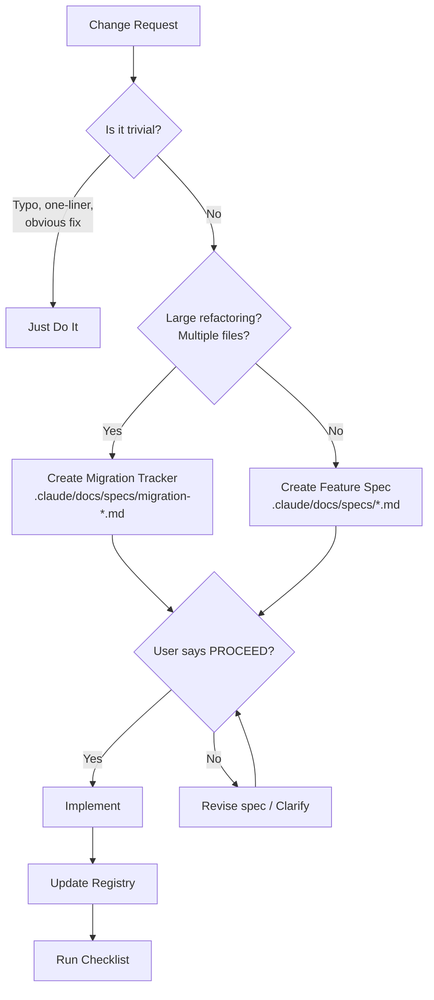

**Key points:**
- Trivial = typos, one-liners, obvious bug fixes → no spec needed
- Multiple files or architectural changes → migration tracker
- Single feature changes → feature spec
- Always wait for PROCEED before implementing non-trivial changes

---

### Registry Verification

Prevents claiming things exist without verification.

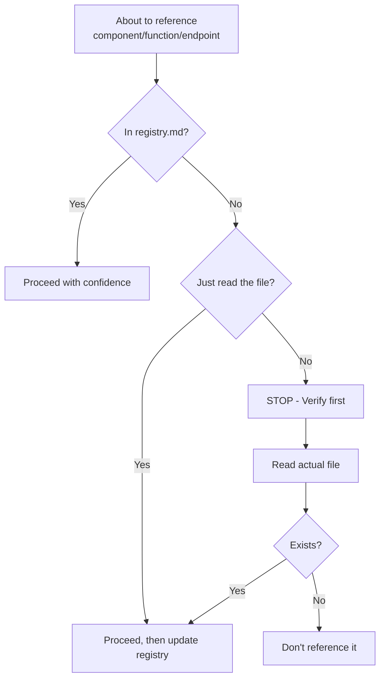

**Golden rule:** If it's not in the registry and I haven't just read the file, I don't know it exists.

---

### Spec Lifecycle

State machine for feature specifications.

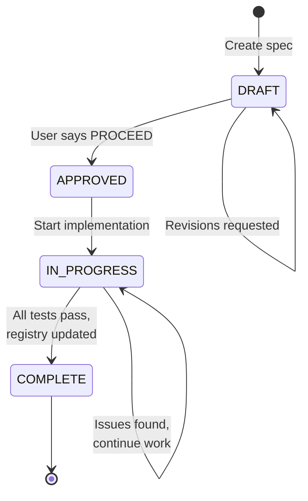

**States:**
- **DRAFT** — Spec created, awaiting approval
- **APPROVED** — Human said PROCEED
- **IN_PROGRESS** — Being implemented
- **COMPLETE** — Done, results recorded

---

### Large File Handling

Prevents missing repeated patterns in files >300 lines.

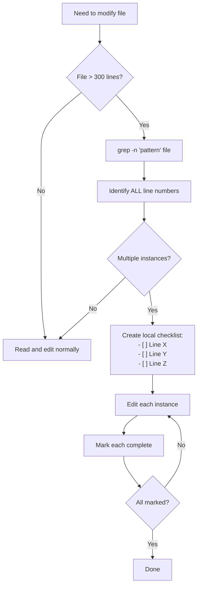

**Why this matters:** When reading large files in chunks, I lose track of repeated patterns. Grep first reveals all locations.

---

## UX-Craft

### Pre-Generation Validation

Validation chain before generating UI code. Gates are ordered by severity.

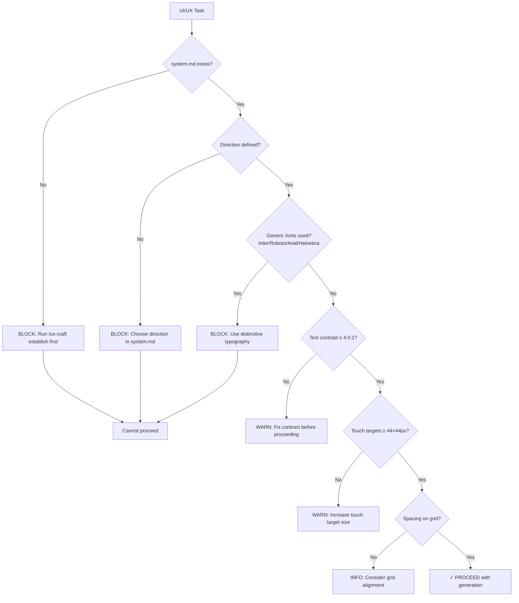

**Severity levels:**
- **BLOCK** — Cannot proceed until fixed (system.md, direction, fonts)
- **WARN** — Should fix, but can proceed with acknowledgment (contrast, touch targets)
- **INFO** — Recommendation only (grid alignment)

---

### Design Direction Selection

Choosing the right design direction based on app type.

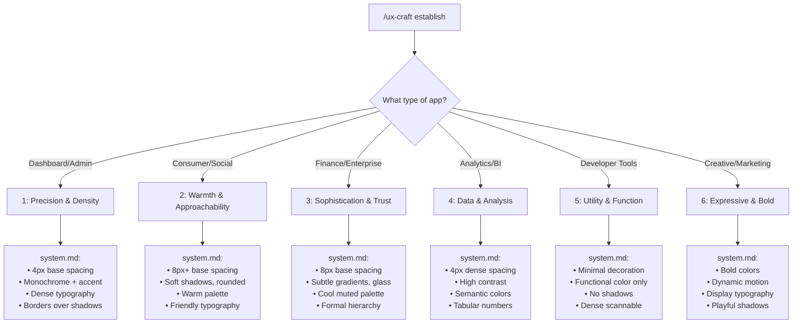

---

### 5-Phase Workflow

The UX-Craft development cycle.

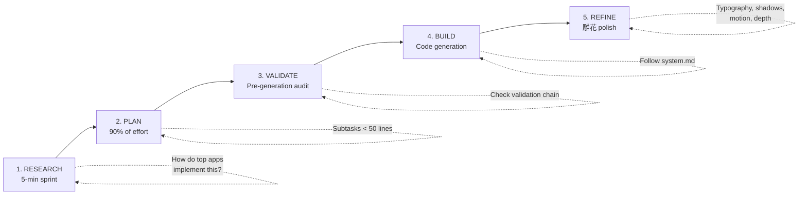

**Phase purposes:**
1. **RESEARCH** — 5-minute research sprint on implementation patterns
2. **PLAN** — Decompose into subtasks <50 lines each (90% of effort here)
3. **VALIDATE** — Run pre-generation validation chain
4. **BUILD** — Generate code following system.md
5. **REFINE** — Polish: typography contrast, shadows, motion

---

## Security-Guardian

### Severity-Based Enforcement

How different vulnerability severities are handled.

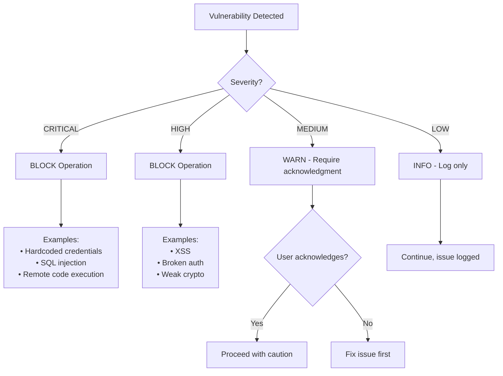

**Enforcement rules:**
- **CRITICAL/HIGH** — Operation blocked, must fix
- **MEDIUM** — Warning shown, requires acknowledgment to proceed
- **LOW** — Informational only, logged but doesn't interrupt

---

### Iteration Degradation Tracking

Tracks security risk as files are modified repeatedly.

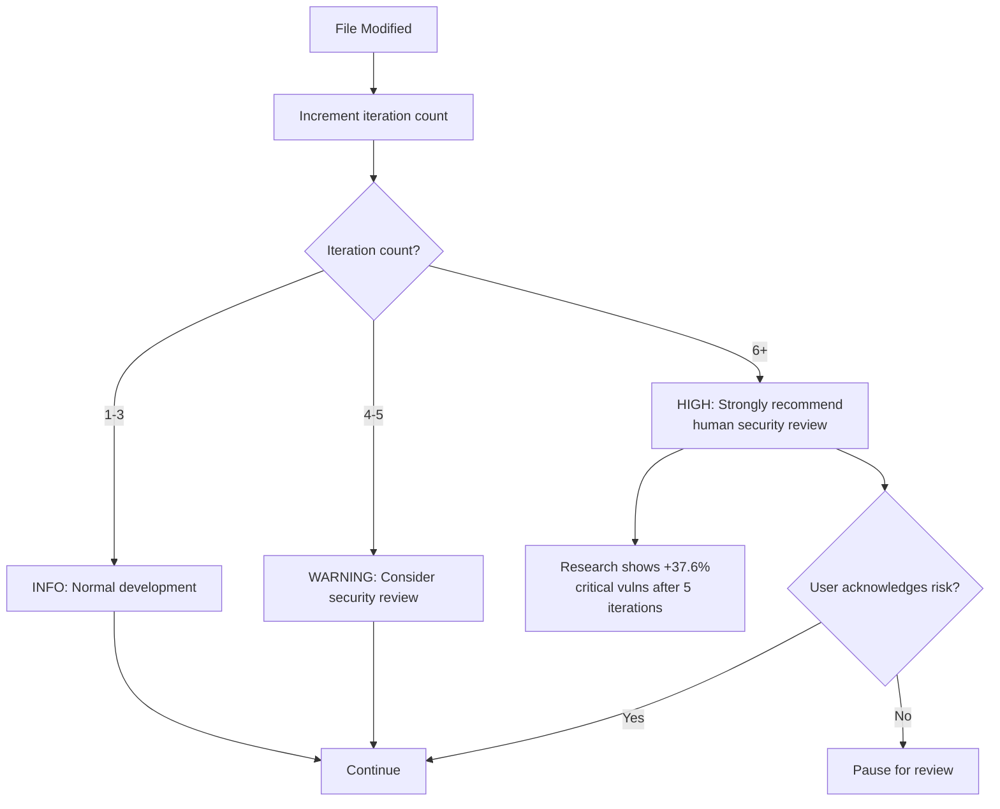

**Why this matters:** IEEE ISTAS 2025 research shows critical vulnerabilities increase 37.6% after 5 AI iteration cycles on the same code.

---

### Security Scan Workflow

Full security scan process.

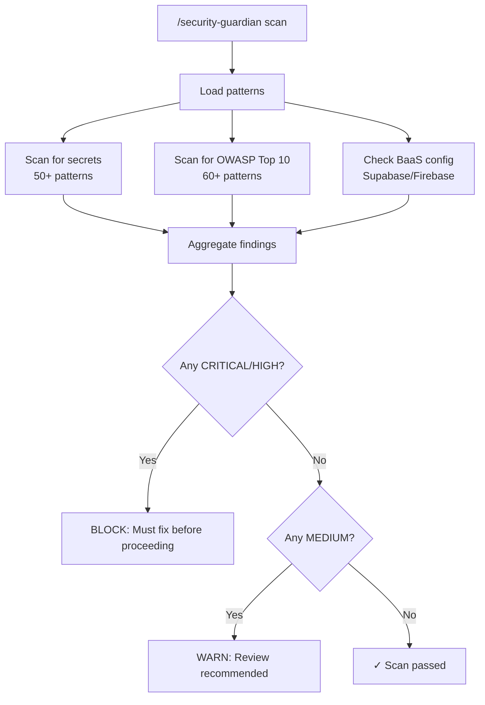

**Scan coverage:**
- **Secrets** — API keys, tokens, credentials (50+ patterns)
- **OWASP** — Injection, XSS, broken auth, etc. (60+ patterns)
- **BaaS** — Supabase RLS, Firebase rules, service key exposure

---

## Dev-Patterns

### Stack Detection

How `/adapt-framework` detects and configures for the project stack.

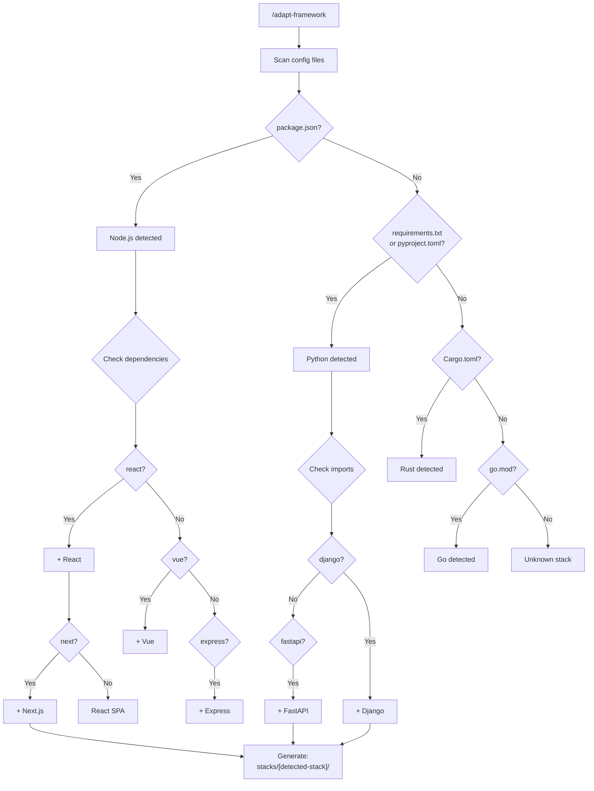

**Output:** Stack-specific patterns in `.claude/skills/dev-patterns/stacks/[stack-name]/`

---

### Code Review Flow

Systematic code review using `/dev-patterns review`.

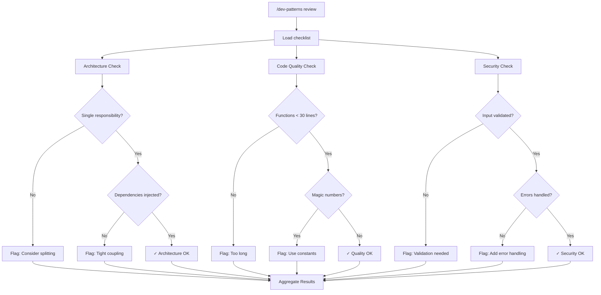

---

## Pre-Commit Checklist

Complete verification flow before committing.

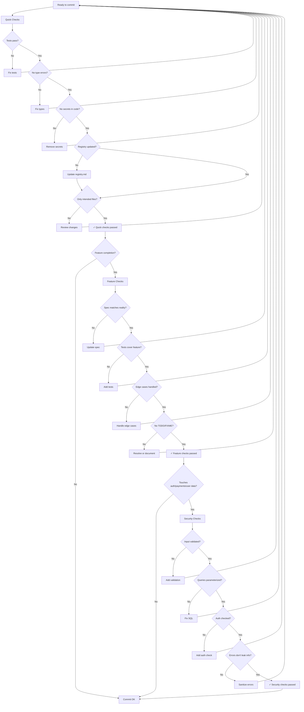

**Three tiers:**
1. **Quick checks** — Every commit (tests, types, secrets, registry)
2. **Feature checks** — When completing a feature (spec, coverage, edge cases)
3. **Security checks** — When touching sensitive code (validation, auth, errors)

---

## Quick Reference

| Workflow | When to Use | Key Gates |
|----------|-------------|-----------|
| Change Classification | Any change request | Trivial? → Refactoring? → Spec? |
| Registry Verification | Before referencing code | In registry? → Just read? → Verify |
| Pre-Generation (UX) | Before UI code | system.md → direction → fonts → contrast |
| Severity Enforcement | Security findings | CRITICAL/HIGH block, MEDIUM warn |
| Iteration Tracking | Repeated file edits | 1-3 OK, 4-5 warn, 6+ review |
| Pre-Commit | Before any commit | Quick → Feature → Security |

---

*Last updated: 2026-01-20*
